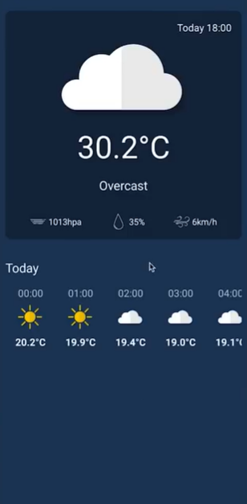
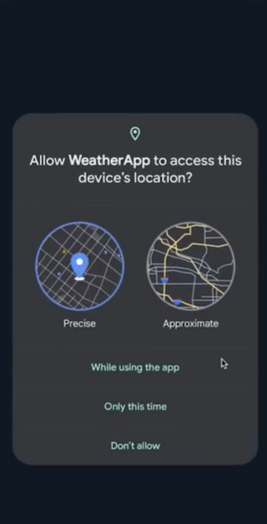

Bu proje, kullanıcının mevcut konumunu otomatik olarak algılayarak Open-Meteo API'sinden hava durumu verilerini çeken
bir hava durumu uygulamasıdır. Proje modern Android geliştirme araçları ve Clean Architecture prensipleri
kullanılarak oluşturulmuştur. Projenin şu anda bazı küçük hatalara sahip olduğunu unutmayın. Başlıca özellikleri;
cihazın GPS veya ağ konumunu alıp izinleri yönetme, anlık hava durumunu (sıcaklık, nem, basınç, rüzgar hızı)
bir kart üzerinde gösterme ve günlük saatlik hava durumu tahminlerini yatay bir listede sunmaktır. Bu proje;
ağ işlemleri için Retrofit ve Moshi, modern UI için Jetpack Compose, asenkron işlemler için Coroutines,
MVVM mimarisi, bağımlılık enjeksiyonu için Hilt ve konum servisleri için Google Play Services Location
kütüphanelerini kullanmaktadır.

<table align="center">
  <tr>
    <td align="center">
      
    </td>
    <td align="center">
      
    </td>
  </tr>
</table>